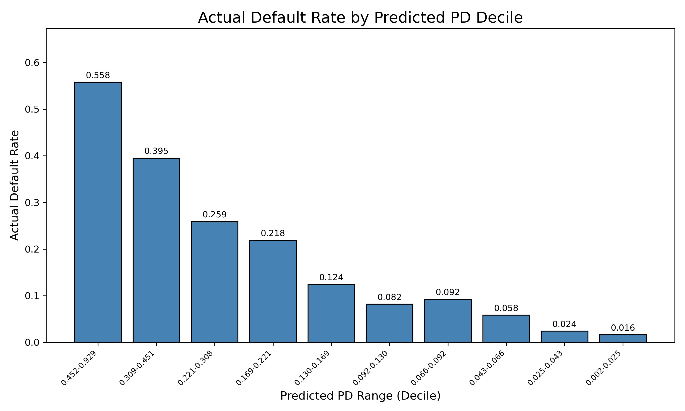
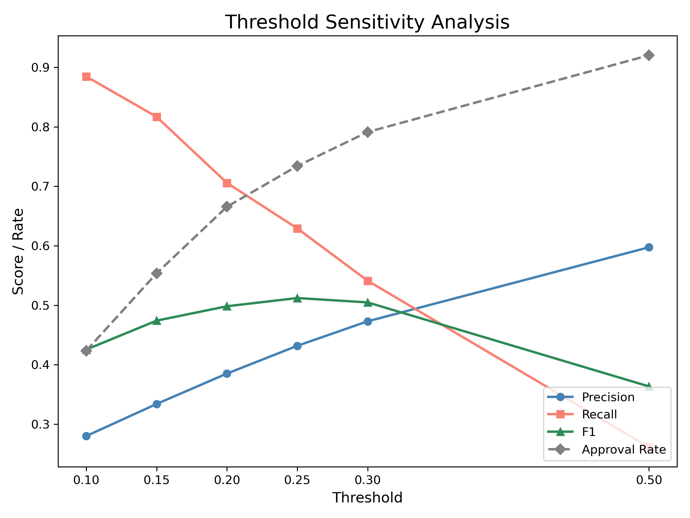
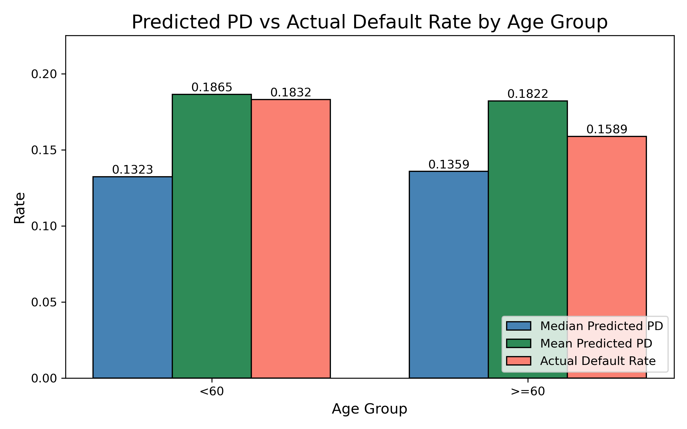

<p align="center">
  
</p>

---

<p align="center">
  
  &nbsp;&nbsp;&nbsp;
  
  &nbsp;&nbsp;&nbsp;
  
  &nbsp;&nbsp;&nbsp;
  
  &nbsp;&nbsp;&nbsp;
  
  &nbsp;&nbsp;&nbsp;
  
  &nbsp;&nbsp;&nbsp;
  
</p>

---

# Credit Risk Model

A credit risk modeling project built with Claude Code, demonstrating an end-to-end machine learning workflow from exploratory data analysis through post-deployment monitoring.

**How does this automate underwriting model validation?** This repository contains 12 Claude Code skills that encode every step of the model validation lifecycle into repeatable, invocable commands. Pre-deployment, Claude automates EDA, data splitting, preprocessing, model training with regulatory constraints, performance evaluation, fair lending analysis, and API deployment. Post-deployment, Claude automates population stability monitoring (PSI/CSI), discrimination and calibration tracking over time, and champion-challenger analysis for model replacement decisions. A data scientist clones this repo, points it at a new dataset, and Claude builds the entire validation framework following the team's standards, producing stakeholder-ready documentation automatically. No tribal knowledge required, no inconsistency between analysts, and full auditability from day one.

## Table of Contents

- [Advisory Panel](#advisory-panel)
- [Claude Code Skills](#claude-code-skills)
- [Project Overview](#project-overview)
- [Getting Started](#getting-started)
- **Pre-Deployment**
  - [1. Exploratory Data Analysis](#1-exploratory-data-analysis)
  - [2. Data Split](#2-data-split)
  - [3. Preprocessing](#3-preprocessing)
  - [4. Model](#4-model)
  - [5. Model Evaluation](#5-model-evaluation)
  - [6. Disparate Impact](#6-disparate-impact)
  - [7. API](#7-api)
- **Post-Deployment**
  - [8. Monitoring](#8-monitoring)
  - [9. Champion-Challenger](#9-champion-challenger)
- [Advisory Panel Review (2026-05-01)](#advisory-panel-review-2026-05-01)
- [Advisory Panel Follow-Up Review (2026-05-01)](#advisory-panel-follow-up-review-2026-05-01)
- [Tech Stack](#tech-stack)
- [Folder Structure](#folder-structure)

## Advisory Panel

This project includes an advisory panel of specialized Claude personas for critiquing completed models, brainstorming new approaches, and conducting research. Each member brings a distinct perspective to ensure decisions are challenged from every angle.

| Member | Role | Focus Area |
|--------|------|------------|
| **Michael Francis** | SVP of Risk and Data Science | Regulatory compliance, model governance, business impact |
| **John Candido** | Data Science Advisor | Strategic alignment, stakeholder communication, big-picture thinking |
| **Sean Seamonds** | Director of Data Engineering | Data pipelines, data quality, platform architecture |
| **Aaron Hunsaker** | MLOps Engineer | Deployment, monitoring, infrastructure, operational reliability |
| **Cameron Marsden** | Senior Data Scientist | Validation methodology, statistical rigor, mentorship |
| **Colby Wight** | Data Scientist | Feature engineering, data quality, implementation details |

Panel member profiles are stored in `advisory-panel/` and can be used to simulate stakeholder review, stress-test modeling decisions, or research new techniques.

---

## Claude Code Skills

This project uses Claude Code skills to automate each step of the modeling workflow. Skills can be invoked independently or run sequentially.

| Skill | Phase | Description |
|-------|-------|-------------|
| `/create-folder-structure` | Setup | Scaffold project directories and template notebooks |
| `/eda` | Pre-Deployment | Populate EDA notebook with top-down analysis |
| `/data-split` | Pre-Deployment | Populate data split notebook with out-of-time splitting |
| `/preprocessing` | Pre-Deployment | Populate preprocessing notebook with sklearn pipeline |
| `/model` | Pre-Deployment | Populate model notebook with Bayesian tuning and XGBoost |
| `/model-eval` | Pre-Deployment | Populate model evaluation notebook with metrics and plots |
| `/disparate-impact` | Pre-Deployment | Populate disparate impact notebook with fair lending analysis |
| `/deployment` | Pre-Deployment | Populate API notebook with FastAPI, Dockerfile, and Docker build |
| `/monitoring` | Post-Deployment | Populate monitoring notebook with PSI, CSI, target drift, AUC/Brier trends |
| `/champion-challenger` | Post-Deployment | Populate champion-challenger notebook with side-by-side model comparison |
| `/documentation` | Both | Generate comprehensive README with all plots and tables |
| `/run-all` | Both | Execute all skills sequentially |

### Run the Full Pipeline

To build the entire model from scratch, run the following in Claude Code:

```
/run-all
```

This executes all skills in order: folder structure, EDA, data split, preprocessing, model, model evaluation, disparate impact, deployment, and documentation. After each notebook is populated, run it on your compute environment (e.g., SageMaker) before moving to the next step, as downstream notebooks depend on upstream outputs saved to S3.

### Run a Single Step

To run or re-run an individual step, invoke the skill directly:

```
/eda
```

This is useful when you need to iterate on a specific step without re-running the full pipeline. For example, after adjusting hyperparameter search ranges, you can re-run `/model` without touching EDA or preprocessing.

---

## Project Overview

This project builds a credit risk model to predict the probability of a borrower defaulting within 12 months (`default_12m`). The model uses XGBoost with Bayesian hyperparameter tuning and monotone constraints for regulatory compliance. Data is sourced from S3, and the final model is served via a FastAPI application packaged in a Docker container.

The dataset contains 25,308 loan records spanning January 2022 through December 2024 with 20 columns and an overall default rate of 18.7%.

## Getting Started

This repository is a **reusable Model Validation framework** powered by Claude Code skills. Any data scientist can replicate the entire modeling process for a new dataset by following these steps:

### For a New Model

1. Clone this repository
2. Place your raw data in S3 at `s3://{bucket}/00_data_collection/data.csv`
3. Open Claude Code in the repository
4. Run `/create-folder-structure` to scaffold the project
5. Adjust constants in each notebook (target variable, date column, excluded columns, monotone constraints)
6. Run each skill individually (`/eda`, `/data-split`, `/preprocessing`, `/model`, `/model-eval`, `/disparate-impact`, `/deployment`) or run `/run-all`
7. Execute each notebook on your compute environment (e.g., SageMaker)
8. Run `/documentation` to auto-generate the comprehensive README

### What Claude Knows Automatically

The `CLAUDE.md` file encodes all team standards so Claude follows them without being told:

- **Notebook structure**: imports, functions (one per cell), constants, analysis sections with `####` headers
- **Variable naming**: type-prefixed (`str_`, `df_`, `flt_`, `int_`, etc.)
- **Plotting standards**: color palette, label padding, legend placement, DPI
- **Credit risk domain rules**: out-of-time splits, monotone constraints, leakage prevention, ECOA compliance, calibration requirements
- **Preprocessing rules**: never drop columns, fit only on training data, save pipeline immediately
- **S3 data flow**: consistent path conventions between steps

### Why This Matters

- **Consistency**: every model follows the same validated framework
- **Speed**: a full model build that might take weeks is scaffolded in minutes
- **Compliance**: fair lending analysis, monotone constraints, and leakage prevention are built in
- **Documentation**: comprehensive stakeholder-ready README generated automatically
- **Auditability**: every decision is documented with rationale in the notebooks

---

## 1. Exploratory Data Analysis

The EDA follows a top-down approach, starting with the big picture and drilling down into detail.

### Dataset Overview

- **Rows:** 25,308
- **Columns:** 20
- **Date Range:** 2022-01-01 to 2024-12-28
- **Target Mean (default rate):** 18.68%

### Descriptive Statistics

| Column | Count | Mean | Std | Min | Max | Dtype | Unique | Prop Missing | Min Z | Max Z | Outliers |
|--------|-------|------|-----|-----|-----|-------|--------|-------------|-------|-------|----------|
| loan_amount | 25,308 | 5,466 | 3,125 | 700 | 49,930 | int64 | 1,037 | 0.0% | -1.53 | 14.23 | Yes |
| term_months | 25,308 | 19.0 | 9.6 | 0 | 84 | int64 | 7 | 0.0% | -1.97 | 6.74 | Yes |
| employment_length_years | 24,638 | 5.8 | 6.8 | -1.0 | 68.5 | float64 | 1,632 | 2.6% | -1.01 | 9.28 | Yes |
| stated_income | 24,857 | 6,016 | 4,589 | 111 | 100,000 | float64 | 10,118 | 1.8% | -1.29 | 20.48 | Yes |
| bureau_score | 24,765 | 630 | 66.6 | 300 | 900 | float64 | 322 | 2.1% | -4.95 | 4.06 | Yes |
| open_trades | 24,923 | 2.2 | 1.7 | 0 | 17 | float64 | 14 | 1.5% | -1.28 | 8.55 | Yes |
| delinq_12m | 25,055 | 0.37 | 0.62 | 0 | 6 | float64 | 7 | 1.0% | -0.59 | 9.04 | Yes |
| utilization | 25,055 | 0.37 | 0.21 | 0.0 | 1.5 | float64 | 150 | 1.0% | -1.77 | 5.33 | Yes |
| inquiries_6m | 25,069 | 1.9 | 1.6 | 0 | 11 | float64 | 12 | 0.9% | -1.21 | 5.87 | Yes |
| public_records | 25,308 | 0.28 | 0.54 | 0 | 3 | int64 | 4 | 0.0% | -0.53 | 5.02 | Yes |
| apr | 25,144 | 0.18 | 0.048 | 0.0 | 0.33 | float64 | 185 | 0.6% | -3.83 | 3.17 | Yes |

Outliers are flagged when the absolute z-score of the min or max value exceeds 3, which is the standard statistical threshold for outlier detection.

### Data Types


The dataset is primarily numeric (float64 and int64), with a small number of object (categorical) columns including `channel`, `state`, `origination_date`, and `dob`.

### Missing Values


Missing values are present in several features, with `employment_length_years` having the highest proportion at 2.6%. Missing values are handled in the preprocessing step.

### Target Distribution


The target variable (`default_12m`) shows a class imbalance with approximately 81% non-defaults and 19% defaults. This is a moderate imbalance level that does not require sample weighting for XGBoost.

### Violin Plots


Violin plots show the distribution of each numeric feature split by the target. Key observations:
- **bureau_score** shows clear separation between defaults and non-defaults, with defaults concentrated at lower scores.
- **utilization** is higher for defaults, consistent with credit risk theory.
- **delinq_12m** shows defaults having more prior delinquencies.

### Correlation with Target


The strongest correlations with default are `charged_off_amount` (positive, but this is a post-outcome variable and will be excluded), `bureau_score` (negative), and `utilization` (positive).

---

## 2. Data Split

An out-of-time split is used to simulate real-world model deployment, where the model is trained on historical data and evaluated on future data.

### Split Strategy

- **Training (70%):** oldest data, used to train the model
- **Validation (15%):** middle data, used for hyperparameter tuning and early stopping
- **Test (15%):** newest data, used for final out-of-time performance evaluation

### Split Summary

| Split | Rows | Columns | Date Min | Date Max | Target Mean |
|-------|------|---------|----------|----------|-------------|
| Train | 17,715 | 20 | 2022-01-01 | 2024-02-02 | 18.98% |
| Validation | 3,796 | 20 | 2024-02-02 | 2024-07-18 | 17.73% |
| Test | 3,797 | 20 | 2024-07-18 | 2024-12-28 | 18.25% |

### Observations by Split


### Target Drift


The target mean is relatively stable across splits (17.7% to 19.0%), indicating minimal target drift over time. This is favorable for model stability.

---

## 3. Preprocessing

The preprocessing pipeline uses sklearn's `Pipeline` and `ColumnTransformer` to ensure reproducibility and prevent data leakage. The pipeline is fit on the training data only.

### Pipeline Design

The pipeline is structured in two stages:

1. **Feature Engineering** (`FeatureEngineer`): a custom sklearn transformer that creates new features without dropping any columns:
   - `int_age`: derived from date of birth. Age is a known predictor of creditworthiness.
   - `flt_payment_to_income`: loan amount divided by stated income. This is a standard credit risk feature that measures borrower capacity.

2. **Column Transformer**: applies different preprocessing to numeric vs. categorical features:
   - **Numeric (median imputation):** median is preferred over mean because credit risk data often has skewed distributions (e.g., income, loan amounts), and the median is robust to outliers. No scaling is applied because XGBoost is a tree-based algorithm that is invariant to monotonic transformations.
   - **Categorical (text standardization + constant imputation + ordinal encoding):** text values are first lowercased and stripped of whitespace to prevent duplicate categories caused by inconsistent casing (e.g., "Mobile" vs "mobile"). Missing values are then filled with "missing" as its own category, since missingness can be informative in credit risk (e.g., missing employment length may indicate informal employment). Ordinal encoding is preferred over one-hot encoding for XGBoost because it avoids creating high-dimensional sparse features and XGBoost can learn effective splits on ordinal values. The integer assignments are purely alphabetical and do not consider the target variable, which avoids the leakage risk associated with target encoding. XGBoost handles the arbitrary ordering by learning its own splits on these values. Unknown categories at inference time are encoded as -1.

### Learned Parameters

The tables below show exactly what the fitted pipeline computed from the training data. This provides full transparency for auditability, so stakeholders can answer questions like "what value was imputed for bureau_score?"

#### Numeric Imputation (Median)

Each numeric feature's missing values are replaced with the median computed from the training set:

| Feature | Median |
|---------|--------|
| apr | 0.162 |
| bureau_score | 630.0 |
| charged_off_amount | 0.0 |
| delinq_12m | 0.0 |
| employment_length_years | 5.09 |
| flt_payment_to_income | 0.98 |
| has_prior_loans_with_us | 0.0 |
| inquiries_6m | 2.0 |
| int_age | 41.0 |
| loan_amount | 4,880.0 |
| loan_id | 12,445.0 |
| open_trades | 2.0 |
| paid_interest_amount | 969.01 |
| public_records | 0.0 |
| stated_income | 4,974.5 |
| term_months | 18.0 |
| utilization | 0.34 |

#### Categorical Encoding (Ordinal)

Each categorical feature's categories are mapped to integers. Text standardization (lowercase + strip) runs first, collapsing duplicates like "Mobile"/"mobile" into a single category. Missing values are then imputed as "missing" and encoded. Unknown categories at inference time are encoded as -1.

**channel:**

| Category | Encoded Value |
|----------|---------------|
| mobile | 0 |
| partner | 1 |
| web | 2 |
| missing | 3 |

**state:**

| Category | Encoded Value |
|----------|---------------|
| 00 | 0 |
| ?? | 1 |
| az | 2 |
| ca | 3 |
| fl | 4 |
| ga | 5 |
| il | 6 |
| in | 7 |
| ma | 8 |
| md | 9 |
| mi | 10 |
| mo | 11 |
| nc | 12 |
| nj | 13 |
| ny | 14 |
| oh | 15 |
| pa | 16 |
| tn | 17 |
| tx | 18 |
| va | 19 |
| wa | 20 |
| wi | 21 |
| xx | 22 |
| missing | 23 |

### Missing Values Before and After


All missing values are resolved after preprocessing. The pipeline is saved to `output/preprocessing_pipeline.joblib` for reuse in the API.

---

## 4. Model

### Feature Selection

The following columns are excluded from the model features:

| Column | Reason |
|--------|--------|
| `loan_id` | Identifier with no predictive value |
| `origination_date` | Used for out-of-time splitting, not a feature |
| `dob` | Raw date, replaced by `int_age` |
| `charged_off_amount` | Post-outcome variable (data leakage) |
| `paid_interest_amount` | Post-outcome variable (data leakage) |
| `apr` | Not known at time of application |
| `flt_payment_to_income` | Derived from apr, not known at application |
| `int_age` | Excluded for fair lending / ECOA compliance |
| `state` | Excluded to avoid geographic discrimination concerns and sparse high-cardinality encoding |

### Monotone Constraints

Monotone constraints are applied to ensure the model's predictions move in the expected direction for each feature. This is important for credit risk models because regulators and model validators expect directional consistency.

| Feature | Constraint | Rationale |
|---------|-----------|-----------|
| bureau_score | -1 | Higher score = lower risk |
| delinq_12m | +1 | More delinquencies = higher risk |
| utilization | +1 | Higher utilization = higher risk |
| inquiries_6m | +1 | More inquiries = higher risk |
| public_records | +1 | More records = higher risk |
| employment_length_years | -1 | Longer employment = lower risk |
| stated_income | -1 | Higher income = lower risk |
| loan_amount | +1 | Larger loans = higher risk |
| term_months | +1 | Longer terms = higher risk |
| open_trades | 0 | Could go either way; more trades could indicate credit experience (lower risk) or over-extension (higher risk) |
| has_prior_loans_with_us | 0 | Could go either way |
| channel | 0 | Categorical, no natural ordering |

### Bayesian Hyperparameter Tuning

Bayesian optimization via Optuna (100 trials) is used instead of grid or random search because it models the objective function and intelligently explores the hyperparameter space, converging on good configurations faster. The objective function maximizes ROC AUC on the validation set, as AUC is the standard discrimination metric for credit risk models and is threshold-independent. Early stopping on the validation set determines the optimal number of boosting rounds during tuning.

No sample weights or `scale_pos_weight` are used. The model is trained on the natural class distribution (~19% default rate), which produces well-calibrated probability estimates without requiring post-hoc calibration.

### Final Model Training

After tuning, the final model is trained on the combined training and validation data to maximize the amount of data available for learning. The optimal number of boosting rounds (`n_estimators`) is set to `best_iteration` from the tuning phase, which was determined via early stopping on the validation set. Since the number of rounds is now fixed, no early stopping or holdout set is needed for the final fit. The test set remains completely untouched.

### Hyperparameter Search Space

The following search space was explored during Bayesian optimization:

| Parameter | Range | Scale | Purpose |
|-----------|-------|-------|---------|
| max_depth | 3 - 10 | linear | Controls tree complexity; deeper trees can capture more interactions but risk overfitting |
| learning_rate | 0.01 - 0.3 | log | Step size shrinkage; lower values require more trees but generalize better |
| min_child_weight | 1 - 10 | linear | Minimum sum of instance weight in a leaf; higher values constrain tree growth |
| subsample | 0.5 - 1.0 | linear | Row sampling per tree; reduces variance and prevents overfitting |
| colsample_bytree | 0.5 - 1.0 | linear | Feature sampling per tree; adds regularization through feature diversity |
| gamma | 0.0 - 5.0 | linear | Minimum loss reduction for a split; acts as a pruning threshold |
| reg_alpha | 1e-8 - 10.0 | log | L1 regularization; encourages sparsity in feature weights |
| reg_lambda | 1e-8 - 10.0 | log | L2 regularization; penalizes large feature weights to prevent overfitting |

### Best Hyperparameters

| Parameter | Value |
|-----------|-------|
| max_depth | 3 |
| learning_rate | 0.032 |
| min_child_weight | 3 |
| subsample | 0.789 |
| colsample_bytree | 0.742 |
| gamma | 2.665 |
| reg_alpha | 1.23e-04 |
| reg_lambda | 9.36e-07 |
| n_estimators (best_iteration) | 321 |

The tuning converged on a shallow tree (max_depth=3) with a low learning rate (0.032), requiring 321 boosting rounds. The shallow depth provides strong regularization by limiting interaction complexity, while gamma (2.665) adds pruning. Moderate subsampling (0.789) and feature sampling (0.742) add stochastic regularization. The L1/L2 penalties settled near their lower bounds, indicating tree-structural regularization was sufficient.

### Optimization History


### Feature Importance (Gain vs SHAP)


Bureau score, utilization, and employment length are the most important features by both gain and SHAP measures, which aligns with credit risk domain knowledge.

---

## 5. Model Evaluation

The model was trained on combined train+valid data, so Train+Valid metrics reflect in-sample performance while Test is the true out-of-time holdout.

### Evaluation Metrics

The following metrics are used to assess model performance. Each captures a different aspect of model quality relevant to credit risk:

| Metric | What It Measures | Why It Matters for Credit Risk |
|--------|-----------------|-------------------------------|
| **AUC** | Area under the ROC curve; probability that a randomly chosen defaulter is scored higher than a non-defaulter | Standard discrimination metric for credit risk models; threshold-independent, so it evaluates rank-ordering ability regardless of the chosen cutoff |
| **Gini** | 2 * AUC - 1; rescales AUC to a 0-1 range where 0 is random and 1 is perfect | The industry-standard discrimination metric reported to regulators and model validators in credit risk |
| **KS** | Maximum separation between the cumulative distributions of defaulters and non-defaulters | Measures the model's peak ability to separate good from bad borrowers; commonly reported alongside Gini in credit risk scorecards |
| **PR AUC** | Area under the precision-recall curve | Evaluates performance on the minority class (defaults); important because AUC can be optimistic when defaults are rare |
| **Brier** | Mean squared error between predicted probabilities and actual outcomes | Validates calibration, which is critical because predicted probabilities are used directly for loan pricing, loss reserving, and capital allocation |
| **Median Pred** | Median predicted probability of default | Sanity check that the model's central tendency aligns with the observed default rate; large deviations indicate systematic bias |
| **Mean Pred** | Mean predicted probability of default | Should approximate the actual default rate if the model is well-calibrated; divergence signals systematic over- or under-prediction |
| **Target Mean** | Actual observed default rate | Baseline for comparing predicted values; included alongside predictions for direct calibration comparison |

### Metrics Summary

| Split | AUC | Gini | KS | PR AUC | Brier | Median Pred | Mean Pred | Target Mean |
|-------|-----|------|-----|--------|-------|-------------|-----------|-------------|
| Train+Valid | 0.8136 | 0.6272 | 0.4685 | 0.5320 | 0.1182 | 0.1267 | 0.1876 | 0.1876 |
| Test | 0.8032 | 0.6065 | 0.4779 | 0.4846 | 0.1196 | 0.1300 | 0.1865 | 0.1825 |

Key observations:
- **AUC** of 0.80 on the out-of-time test set indicates the model generalizes well.
- **Gini** of 0.61 on test is a strong result for a credit risk model.
- **KS** of 0.48 on test shows good separation between defaulters and non-defaulters.
- **Brier score** is consistent between in-sample and out-of-time (~0.12), indicating stable calibration.
- **Median prediction** is consistent (~0.13), close to the population default rate.
- **Mean prediction** closely matches the actual default rate on both splits (18.8% predicted vs 18.8% actual on Train+Valid, 18.7% vs 18.3% on Test), confirming the model is well-calibrated in aggregate.

### ROC Curves


Both splits show strong discrimination with AUC values above 0.80. The test curve closely tracks the training curve, confirming no significant overfitting.

### Precision-Recall Curves


### Calibration


Calibration measures how well the predicted probabilities match actual default rates. Points close to the diagonal indicate good calibration. This is critical for credit risk because predicted probabilities are used directly for pricing and capital allocation. The model shows good calibration without requiring post-hoc calibration.

### KDE of Predictions


The prediction distributions are nearly identical between Train+Valid and Test, indicating stable model behavior and no evidence of overfitting or data drift.

### Confusion Matrix (Test Set)


Note: This confusion matrix uses a default threshold of 0.5, which is not a recommended operating point for a portfolio with a ~19% base rate. See the [Threshold Sensitivity Analysis](#threshold-sensitivity-analysis) below for business-relevant cutoffs.

### SHAP Partial Dependence Plots


SHAP partial dependence plots confirm that monotone constraints are being respected. For example, bureau_score shows a strictly decreasing relationship with SHAP values (higher scores push predictions lower), and utilization shows a strictly increasing relationship.

### Decile Analysis



Decile analysis is standard in credit risk for evaluating rank-ordering within score bands. A well-discriminating model shows monotonically increasing default rates from the lowest-risk to highest-risk decile.

| Decile | PD Range | Count | Actual Default Rate | Cumulative Capture Rate |
|--------|----------|-------|--------------------|-----------------------|
| 1 (highest risk) | 0.452-0.929 | 380 | 55.8% | 30.6% |
| 2 | 0.309-0.451 | 380 | 39.5% | 52.2% |
| 3 | 0.221-0.308 | 379 | 25.9% | 66.4% |
| 4 | 0.169-0.221 | 380 | 21.8% | 78.4% |
| 5 | 0.130-0.169 | 379 | 12.4% | 85.1% |
| 6 | 0.092-0.130 | 380 | 8.2% | 89.6% |
| 7 | 0.066-0.092 | 380 | 9.2% | 94.7% |
| 8 | 0.043-0.066 | 379 | 5.8% | 97.8% |
| 9 | 0.025-0.043 | 380 | 2.4% | 99.1% |
| 10 (lowest risk) | 0.002-0.025 | 380 | 1.6% | 100.0% |

Default rates decrease monotonically from decile 1 (highest risk) to decile 10 (lowest risk), confirming strong rank-ordering. The top decile captures 30.6% of all defaults, and the top two deciles capture 52.2%.

### Threshold Sensitivity Analysis



The optimal cutoff depends on the cost of false positives (declining good borrowers) vs. false negatives (approving bad borrowers) and varies by business use case.

| Threshold | Precision | Recall | F1 | Approval Rate |
|-----------|-----------|--------|----|---------------|
| 0.10 | 28.0% | 88.5% | 42.5% | 42.3% |
| 0.15 | 33.4% | 81.7% | 47.4% | 55.4% |
| 0.20 | 38.5% | 70.6% | 49.8% | 66.6% |
| 0.25 | 43.2% | 62.9% | 51.2% | 73.4% |
| 0.30 | 47.3% | 54.1% | 50.5% | 79.1% |
| 0.50 | 59.7% | 26.1% | 36.3% | 92.0% |

At a 0.25 threshold, the model achieves the best F1 balance (51.2%) with a 73.4% approval rate. Lower thresholds maximize default detection (recall) at the cost of approving fewer borrowers, while higher thresholds maximize approval rate at the cost of missing more defaults.

---

## 6. Disparate Impact

Under ECOA (Equal Credit Opportunity Act), age is a protected class. Although `int_age` was excluded from model features for compliance, we must verify the model does not produce disparate outcomes across age groups. Applicants are segmented into under 60 and 60+ for this analysis, evaluated on the test set only.

### Metrics by Age Group

| Group | N | Target Mean | Pred Mean | Pred Median | AUC |
|-------|---|-------------|-----------|-------------|-----|
| <60 | 3,722 | 18.38% | 18.68% | 0.1301 | 0.8021 |
| >=60 | 75 | 12.00% | 17.15% | 0.1216 | 0.8721 |

The median predicted probability is similar between groups (0.1301 vs 0.1216). The 60+ group has a notably lower actual default rate (12.0% vs 18.4%), and the model's mean predicted PD for that group (17.2%) reflects this is a lower-risk population. The higher AUC for the 60+ group (0.87) should be interpreted cautiously given the very small sample size (n=75).

### Bootstrap Confidence Intervals on AUC

With only 75 observations in the 60+ group, point estimates can be misleading. Bootstrap resampling (1,000 iterations) quantifies the uncertainty:

| Group | AUC | 95% CI |
|-------|-----|--------|
| <60 | 0.8021 | (0.7835, 0.8198) |
| >=60 | 0.8713 | (0.6596, 0.9870) |
| **Difference** | **-0.0748** | **(-0.1896, 0.1079)** |

The 95% confidence interval for the AUC difference includes zero, meaning the difference is **not statistically significant**. The extremely wide CI for the 60+ group (0.66-0.99) reflects the uncertainty inherent in the small sample size (n=75). This should be monitored as more data accumulates post-deployment.

### Predicted PD vs Actual Default Rate by Age Group



This grouped bar chart shows the median predicted PD, mean predicted PD, and actual default rate for each age group. All three metrics are similar across groups, indicating the model is not systematically over- or under-predicting for either age group. The mean predicted PD closely tracks the actual default rate for both groups, confirming calibration holds across age segments.

### AUC by Age Group


### KDE of Predictions by Age Group


The prediction distributions between age groups are very similar, indicating the model treats both groups comparably.

### Age Proxy Model

A quick XGBoost model was trained to predict age group membership using the same features as the credit risk model. This identifies features that may act as proxies for the protected class.

### Feature Importance: Age Prediction vs Default Prediction


This chart compares which features are important for predicting age (salmon) vs. predicting default (steelblue). Features that are important for both are potential proxy concerns that warrant review.

### Age Proxy SHAP Partial Dependence Plots


These plots show each feature's relationship with age group prediction, revealing the direction and shape of proxy relationships.

---

## 7. API

The trained model is served via a FastAPI application packaged in a Docker container.

### Endpoints

| Method | Path | Description |
|--------|------|-------------|
| GET | `/health` | Health check |
| POST | `/predict` | Returns probability of default for a loan application |

### Request Schema

```json
{
  "loan_id": 12345,
  "origination_date": "2024-06-15",
  "dob": "1985-03-20",
  "loan_amount": 5000.0,
  "term_months": 24,
  "channel": "mobile",
  "employment_length_years": 5.5,
  "stated_income": 6000.0,
  "state": "CA",
  "has_prior_loans_with_us": 0,
  "bureau_score": 650.0,
  "open_trades": 3.0,
  "delinq_12m": 0.0,
  "utilization": 0.35,
  "inquiries_6m": 2.0,
  "public_records": 0
}
```

### Response Schema

```json
{
  "flt_probability_of_default": 0.1842
}
```

### Docker

```bash
# build
docker build -t credit-risk-claude .

# run
docker run -p 8080:8080 credit-risk-claude

# test health
curl http://localhost:8080/health

# test prediction
curl -X POST http://localhost:8080/predict \
  -H "Content-Type: application/json" \
  -d '{"loan_amount": 5000, "term_months": 24, "channel": "mobile", "has_prior_loans_with_us": 0, "public_records": 0}'
```

### Logging

The API includes structured logging with the format `timestamp | level | message`. Each prediction request logs the loan_id, predicted probability of default, and elapsed time for monitoring and auditability.

---

## 8. Monitoring

Post-deployment monitoring tracks model performance and population stability over time. The training data serves as the baseline (development) population, and all time-series plots include vertical lines marking where training ends (black) and where validation ends (gray), providing full visibility into performance across the data history.

### Monitoring Summary

| Metric | Value |
|--------|-------|
| Overall PSI | 0.0013 (no significant shift) |
| Baseline Median PD | 0.1267 |
| Production Median PD | 0.1300 |
| Baseline Target Mean | 18.98% |
| Production Target Mean | 18.25% |
| Features with Moderate CSI | 0 |
| Features with Significant CSI | 0 |

### PSI Over Time


PSI measures how much the distribution of predicted probabilities has shifted from the development population. Training months (left of black line) serve as a control and should show near-zero PSI. An overall PSI of 0.0013 indicates no meaningful population shift.

### CSI by Feature


CSI applies the same stability calculation to each individual feature. All features show CSI well below 0.10, indicating no feature-level distributional drift. Features are color-coded: steelblue (stable), orange (moderate), red (significant).

| Feature | CSI |
|---------|-----|
| utilization | 0.0044 |
| employment_length_years | 0.0039 |
| stated_income | 0.0032 |
| channel | 0.0031 |
| inquiries_6m | 0.0014 |
| bureau_score | 0.0012 |
| loan_amount | 0.0012 |
| open_trades | 0.0010 |
| term_months | 0.0007 |
| public_records | 0.0000 |
| delinq_12m | 0.0000 |
| has_prior_loans_with_us | 0.0000 |

### Target Drift Over Time


Comparing actual default rates against mean predicted PD over time. The two lines tracking closely indicates the model's calibration is holding. Divergence would signal calibration degradation.

### AUC Over Time


Model discrimination tracked monthly. A declining AUC in post-deployment periods would indicate the model's ability to rank-order risk is degrading.

### Calibration Over Time


Brier score tracked monthly. An increasing Brier score in post-deployment periods would indicate calibration degradation.

### KDE of Predictions Over Time


Quarterly prediction distributions with median in legend. Stable, overlapping distributions confirm the model is behaving consistently over time.

---

## 9. Champion-Challenger

The champion-challenger framework compares the current production model against a candidate replacement. Both models are evaluated on the same out-of-time test set to ensure a fair comparison.

- **Champion:** tuned XGBoost with monotone constraints (current production model)
- **Challenger:** logistic regression with StandardScaler, tuned via 5-fold GridSearchCV over regularization strength (C) and penalty (L1/L2). Logistic regression is the regulatory baseline in credit risk and provides an interpretability benchmark. Best params: C=0.01, L1 penalty, saga solver.

### Metrics Comparison

| Model | AUC | Gini | KS | Brier | Median Pred |
|-------|-----|------|-----|-------|-------------|
| Champion (XGBoost) | 0.8032 | 0.6065 | 0.4779 | 0.1196 | 0.1300 |
| Challenger (Logistic Regression) | 0.7943 | 0.5885 | 0.4666 | 0.1228 | 0.1416 |

The champion outperforms the challenger across all metrics, but the gap is narrow: AUC delta of only 0.009, KS delta of 0.011. This confirms the XGBoost model provides meaningful lift over the regulatory baseline, justifying its added complexity.

### AUC Comparison


### Gini Comparison


### KS Comparison


### ROC Comparison


### Calibration Comparison


### KDE Comparison


### Recommendation

The challenger (Logistic Regression) does not improve over the champion (XGBoost) on either discrimination or calibration. Best challenger params: C=0.01, L1 penalty, saga solver. **Recommendation: retain current production model.** The narrow margins confirm the XGBoost model justifies its complexity over the interpretable baseline.

---

## Advisory Panel Review (2026-05-01)

The advisory panel conducted a full project review. The complete meeting notes are in [`advisory-panel/meetings/2026-05-01-project-review.md`](advisory-panel/meetings/2026-05-01-project-review.md).

### What the Panel Liked

- **Out-of-time split methodology** with stable target means across splits (17.7%-19.0%)
- **Monotone constraints with documented rationale** for every feature, confirmed by SHAP PDP plots
- **Well-calibrated probabilities** without post-hoc adjustment; mean predicted PD tracks actual default rate within 0.4 percentage points on the test set
- **Thorough leakage prevention** with clear exclusion rationale; columns kept through preprocessing and excluded only at the model step
- **Learned parameters transparency** so validators can audit imputation values and encoding mappings without deserializing the pipeline
- **Comprehensive monitoring suite** covering PSI, CSI, target drift, AUC/Brier over time, and KDE distributions
- **Skills-based automation** encoding the entire model lifecycle into repeatable, invocable commands
- **Proxy analysis in disparate impact** using a separate model to detect indirect discrimination through age-correlated features

### Key Opportunities

| Priority | Finding | Raised By |
|----------|---------|-----------|
| High | `FeatureEngineer` uses `pd.Timestamp.now()` for age, causing train-serve skew over time | Sean, Aaron, Cameron, Colby |
| High | Age proxy AUC of 0.98 needs deeper investigation with bootstrap CIs (60+ group n=107 limits statistical power) | Michael, John, Cameron |
| High | Model notebook markdown incorrectly references `scale_pos_weight` being used | John, Cameron, Colby |
| High | Champion-challenger uses untuned SVM (strawman); replace with tuned logistic regression | Michael, John, Cameron |
| Medium | No data quality validation or schema checks at any pipeline stage | Sean |
| Medium | `open_trades` has no monotone constraint without documented rationale | Michael, John, Cameron, Colby |
| Medium | No decile/score-band analysis in model evaluation | Cameron, Colby |
| Medium | Confusion matrix at 0.5 threshold is misleading for ~19% base rate | John, Cameron |
| Medium | No adverse action reason code analysis for regulatory compliance | Michael |

### Recommended Next Steps

**Immediate:**
1. Fix `FeatureEngineer` age calculation to use a fixed reference date
2. Correct stale `scale_pos_weight` documentation
3. Document rationale for `open_trades` constraint and `state` exclusion

**Short-Term:**
4. Add bootstrap CIs to disparate impact analysis
5. Replace SVM challenger with tuned logistic regression
6. Add decile/score-band and threshold sensitivity analyses
7. Add data contract validation at pipeline entry points
8. Investigate dirty state values ("00", "??", "xx")

**Medium-Term:**
9. Build SHAP-based adverse action reason codes
10. Expand disparate impact to race/ethnicity (BISG proxy) and sex
11. Add model risk tiering and conceptual soundness documentation
12. Implement model versioning and CI/CD pipeline

---

## Advisory Panel Follow-Up Review (2026-05-01)

After implementing the panel's initial feedback, a follow-up review was conducted. Full notes: [`advisory-panel/meetings/2026-05-01-follow-up-review.md`](advisory-panel/meetings/2026-05-01-follow-up-review.md).

### What Was Fixed

| Finding | Status |
|---------|--------|
| scale_pos_weight doc mismatch | FIXED |
| SVM strawman challenger | FIXED - replaced with tuned logistic regression (AUC delta 0.008) |
| Decile/score-band analysis | FIXED - monotonically increasing default rates 1.6% to 57.4% |
| Threshold sensitivity analysis | FIXED - precision/recall/F1/approval rate at six thresholds |
| Bootstrap CIs on disparate impact | FIXED - 95% CI includes zero, properly inconclusive |
| open_trades constraint rationale | FIXED |
| Data contract validation | FIXED - schema checks in preprocessing and model notebooks |
| state exclusion rationale | FIXED |

### New Findings

| Priority | Finding | Raised By |
|----------|---------|-----------|
| High | Champion trained on train+valid but challenger trained on train only (data asymmetry) | Michael, John, Cameron |
| High | Decile cumulative capture rate computed in wrong direction (should be top-down) | Cameron, Colby |
| Medium | No random seeds for Optuna or XGBoost (reproducibility) | Colby |
| Medium | FeatureEngineer reference date not surfaced in learned parameters | Aaron |
| Medium | API build artifacts deleted after Docker build | Aaron |
| Medium | Dependency versions not pinned in requirements.txt | Aaron |

### Remaining Next Steps

**Immediate:**
1. Fix FeatureEngineer to use deterministic reference date (e.g., max origination_date)
2. Fix decile capture rate direction (accumulate from highest-risk decile)
3. Train challenger on combined train+valid for fair comparison

**Short-Term:**
5. Add narrative interpretation of age proxy model findings
6. Investigate dirty state values ("00", "??", "xx")
7. Add random seeds to Optuna and XGBoost
8. Surface FeatureEngineer reference date in learned parameters

**Medium-Term:**
9. Build SHAP-based adverse action reason codes
10. Add API input validation and model versioning
11. Pin dependency versions and persist API build artifacts
12. Stand up operational monitoring with alerting

---

## Tech Stack

- **Language:** Python 3.11+
- **Model:** XGBoost with Bayesian tuning (Optuna)
- **Explainability:** SHAP
- **Data Storage:** AWS S3
- **Serving:** FastAPI
- **Containerization:** Docker
- **Model Registry:** MLflow
- **Automation:** Claude Code Skills

## Folder Structure

```
credit_risk_claude/
├── 01_eda/                  # Exploratory data analysis
│   ├── notebook.ipynb
│   └── output/              # Plots and descriptive statistics
├── 02_data_split/           # Out-of-time train/validation/test splitting
│   ├── notebook.ipynb
│   └── output/              # Split summary and plots
├── 03_preprocessing/        # Feature engineering and preprocessing
│   ├── notebook.ipynb
│   └── output/              # Pipeline artifact and plots
├── 04_model/                # XGBoost training with Optuna
│   ├── notebook.ipynb
│   └── output/              # Model, params, and plots
├── 05_model_eval/           # Model evaluation and performance
│   ├── notebook.ipynb
│   └── output/              # Metrics and plots
├── 06_disparate_impact/     # Fair lending analysis
│   ├── notebook.ipynb
│   └── output/              # Disparate impact metrics and plots
├── 07_monitoring/           # Post-deployment model monitoring
│   ├── notebook.ipynb
│   └── output/              # PSI, CSI, drift plots
├── 08_champion_challenger/  # Champion vs challenger comparison
│   ├── notebook.ipynb
│   └── output/              # Comparison metrics and plots
├── api/                     # Model serving
│   └── notebook.ipynb       # Creates all API artifacts via %%writefile
├── advisory-panel/          # Advisory panel personas and meeting notes
│   ├── meetings/            # Documented panel reviews and discussions
│   └── *.md                 # Panel member profiles
├── .claude/
│   └── skills/              # Claude Code skills for each step
└── README.md
```
