<p align="center">
  
</p>

# Credit Risk Model

A credit risk modeling project built with Claude Code, demonstrating an end-to-end machine learning workflow from exploratory data analysis through post-deployment monitoring.

## Table of Contents

- [Claude Code Skills](#claude-code-skills)
- [Project Overview](#project-overview)
- [Getting Started](#getting-started)
- **Pre-Deployment**
  - [1. Exploratory Data Analysis](#1-exploratory-data-analysis)
  - [2. Data Split](#2-data-split)
  - [3. Preprocessing](#3-preprocessing)
  - [4. Model](#4-model)
  - [5. Model Evaluation](#5-model-evaluation)
  - [6. Disparate Impact](#6-disparate-impact)
  - [7. API](#7-api)
- **Post-Deployment**
  - [8. Monitoring](#8-monitoring)
  - [9. Champion-Challenger](#9-champion-challenger)
- [Tech Stack](#tech-stack)
- [Folder Structure](#folder-structure)

## Claude Code Skills

This project uses Claude Code skills to automate each step of the modeling workflow. Skills can be invoked independently or run sequentially.

| Skill | Phase | Description |
|-------|-------|-------------|
| `/create-folder-structure` | Setup | Scaffold project directories and template notebooks |
| `/eda` | Pre-Deployment | Populate EDA notebook with top-down analysis |
| `/data-split` | Pre-Deployment | Populate data split notebook with out-of-time splitting |
| `/preprocessing` | Pre-Deployment | Populate preprocessing notebook with sklearn pipeline |
| `/model` | Pre-Deployment | Populate model notebook with Bayesian tuning and XGBoost |
| `/model-eval` | Pre-Deployment | Populate model evaluation notebook with metrics and plots |
| `/disparate-impact` | Pre-Deployment | Populate disparate impact notebook with fair lending analysis |
| `/deployment` | Pre-Deployment | Populate API notebook with FastAPI, Dockerfile, and Docker build |
| `/monitoring` | Post-Deployment | Populate monitoring notebook with PSI, CSI, target drift, AUC/Brier trends |
| `/champion-challenger` | Post-Deployment | Populate champion-challenger notebook with side-by-side model comparison |
| `/documentation` | Both | Generate comprehensive README with all plots and tables |
| `/run-all` | Both | Execute all skills sequentially |

### Run the Full Pipeline

To build the entire model from scratch, run the following in Claude Code:

```
/run-all
```

This executes all skills in order: folder structure, EDA, data split, preprocessing, model, model evaluation, disparate impact, deployment, and documentation. After each notebook is populated, run it on your compute environment (e.g., SageMaker) before moving to the next step, as downstream notebooks depend on upstream outputs saved to S3.

### Run a Single Step

To run or re-run an individual step, invoke the skill directly:

```
/eda
```

This is useful when you need to iterate on a specific step without re-running the full pipeline. For example, after adjusting hyperparameter search ranges, you can re-run `/model` without touching EDA or preprocessing.

---

## Project Overview

This project builds a credit risk model to predict the probability of a borrower defaulting within 12 months (`default_12m`). The model uses XGBoost with Bayesian hyperparameter tuning and monotone constraints for regulatory compliance. Data is sourced from S3, and the final model is served via a FastAPI application packaged in a Docker container.

The dataset contains 25,308 loan records spanning January 2022 through December 2024 with 20 columns and an overall default rate of 18.7%.

## Getting Started

This repository is a **reusable Model Validation framework** powered by Claude Code skills. Any data scientist can replicate the entire modeling process for a new dataset by following these steps:

### For a New Model

1. Clone this repository
2. Place your raw data in S3 at `s3://{bucket}/00_data_collection/data.csv`
3. Open Claude Code in the repository
4. Run `/create-folder-structure` to scaffold the project
5. Adjust constants in each notebook (target variable, date column, excluded columns, monotone constraints)
6. Run each skill individually (`/eda`, `/data-split`, `/preprocessing`, `/model`, `/model-eval`, `/disparate-impact`, `/deployment`) or run `/run-all`
7. Execute each notebook on your compute environment (e.g., SageMaker)
8. Run `/documentation` to auto-generate the comprehensive README

### What Claude Knows Automatically

The `CLAUDE.md` file encodes all team standards so Claude follows them without being told:

- **Notebook structure**: imports, functions (one per cell), constants, analysis sections with `####` headers
- **Variable naming**: type-prefixed (`str_`, `df_`, `flt_`, `int_`, etc.)
- **Plotting standards**: color palette, label padding, legend placement, DPI
- **Credit risk domain rules**: out-of-time splits, monotone constraints, leakage prevention, ECOA compliance, calibration requirements
- **Preprocessing rules**: never drop columns, fit only on training data, save pipeline immediately
- **S3 data flow**: consistent path conventions between steps

### Why This Matters

- **Consistency**: every model follows the same validated framework
- **Speed**: a full model build that might take weeks is scaffolded in minutes
- **Compliance**: fair lending analysis, monotone constraints, and leakage prevention are built in
- **Documentation**: comprehensive stakeholder-ready README generated automatically
- **Auditability**: every decision is documented with rationale in the notebooks

---

## 1. Exploratory Data Analysis

The EDA follows a top-down approach, starting with the big picture and drilling down into detail.

### Dataset Overview

- **Rows:** 25,308
- **Columns:** 20
- **Date Range:** 2022-01-01 to 2024-12-28
- **Target Mean (default rate):** 18.68%

### Descriptive Statistics

| Column | Count | Mean | Std | Min | Max | Dtype | Unique | Prop Missing | Min Z | Max Z | Outliers |
|--------|-------|------|-----|-----|-----|-------|--------|-------------|-------|-------|----------|
| loan_amount | 25,308 | 5,466 | 3,125 | 700 | 49,930 | int64 | 1,037 | 0.0% | -1.53 | 14.23 | Yes |
| term_months | 25,308 | 19.0 | 9.6 | 0 | 84 | int64 | 7 | 0.0% | -1.97 | 6.74 | Yes |
| employment_length_years | 24,638 | 5.8 | 6.8 | -1.0 | 68.5 | float64 | 1,632 | 2.6% | -1.01 | 9.28 | Yes |
| stated_income | 24,857 | 6,016 | 4,589 | 111 | 100,000 | float64 | 10,118 | 1.8% | -1.29 | 20.48 | Yes |
| bureau_score | 24,765 | 630 | 66.6 | 300 | 900 | float64 | 322 | 2.1% | -4.95 | 4.06 | Yes |
| open_trades | 24,923 | 2.2 | 1.7 | 0 | 17 | float64 | 14 | 1.5% | -1.28 | 8.55 | Yes |
| delinq_12m | 25,055 | 0.37 | 0.62 | 0 | 6 | float64 | 7 | 1.0% | -0.59 | 9.04 | Yes |
| utilization | 25,055 | 0.37 | 0.21 | 0.0 | 1.5 | float64 | 150 | 1.0% | -1.77 | 5.33 | Yes |
| inquiries_6m | 25,069 | 1.9 | 1.6 | 0 | 11 | float64 | 12 | 0.9% | -1.21 | 5.87 | Yes |
| public_records | 25,308 | 0.28 | 0.54 | 0 | 3 | int64 | 4 | 0.0% | -0.53 | 5.02 | Yes |
| apr | 25,144 | 0.18 | 0.048 | 0.0 | 0.33 | float64 | 185 | 0.6% | -3.83 | 3.17 | Yes |

Outliers are flagged when the absolute z-score of the min or max value exceeds 3, which is the standard statistical threshold for outlier detection.

### Data Types

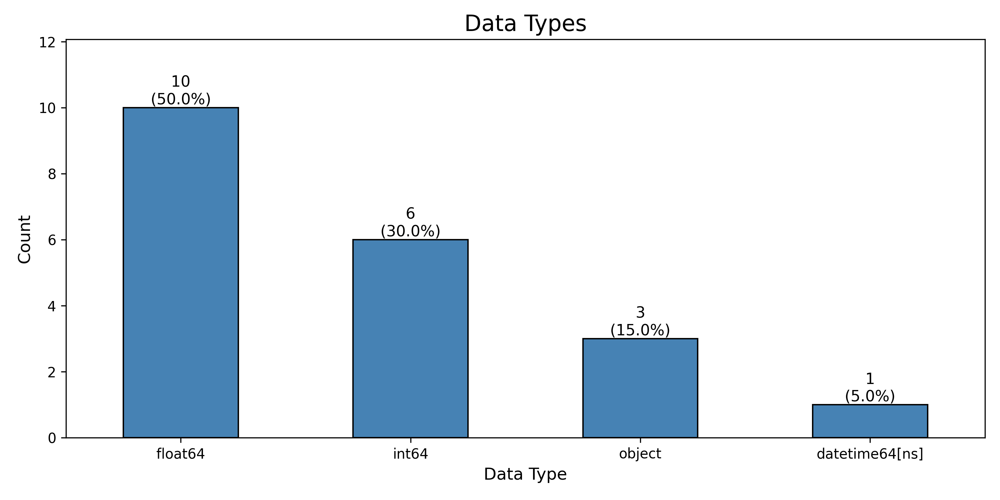

The dataset is primarily numeric (float64 and int64), with a small number of object (categorical) columns including `channel`, `state`, `origination_date`, and `dob`.

### Missing Values

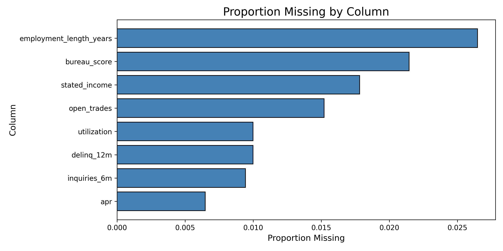

Missing values are present in several features, with `employment_length_years` having the highest proportion at 2.6%. Missing values are handled in the preprocessing step.

### Target Distribution

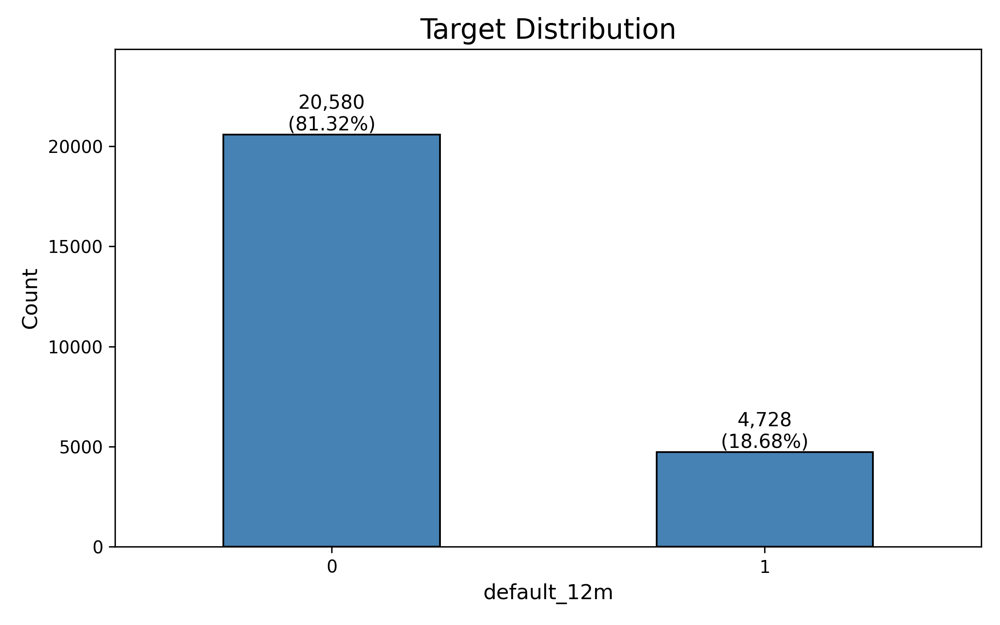

The target variable (`default_12m`) shows a class imbalance with approximately 81% non-defaults and 19% defaults. This is a moderate imbalance level that does not require sample weighting for XGBoost.

### Violin Plots

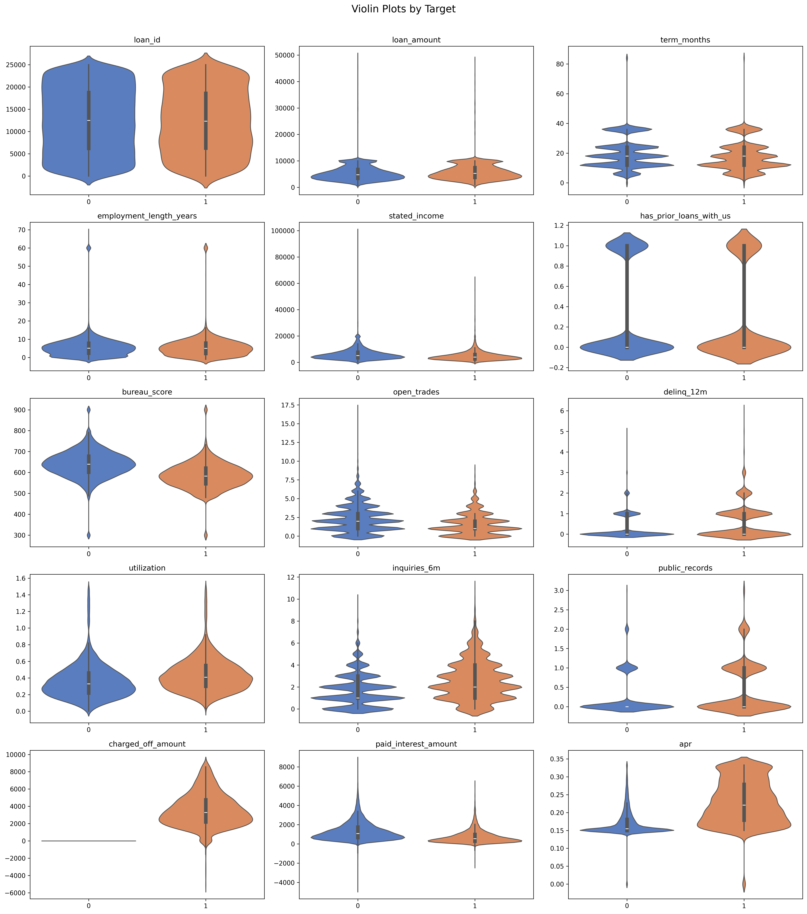

Violin plots show the distribution of each numeric feature split by the target. Key observations:
- **bureau_score** shows clear separation between defaults and non-defaults, with defaults concentrated at lower scores.
- **utilization** is higher for defaults, consistent with credit risk theory.
- **delinq_12m** shows defaults having more prior delinquencies.

### Correlation with Target

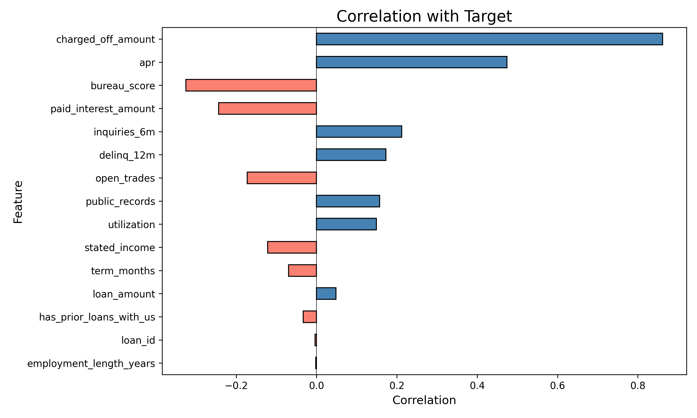

The strongest correlations with default are `charged_off_amount` (positive, but this is a post-outcome variable and will be excluded), `bureau_score` (negative), and `utilization` (positive).

---

## 2. Data Split

An out-of-time split is used to simulate real-world model deployment, where the model is trained on historical data and evaluated on future data.

### Split Strategy

- **Training (70%):** oldest data, used to train the model
- **Validation (15%):** middle data, used for hyperparameter tuning and early stopping
- **Test (15%):** newest data, used for final out-of-time performance evaluation

### Split Summary

| Split | Rows | Columns | Date Min | Date Max | Target Mean |
|-------|------|---------|----------|----------|-------------|
| Train | 17,715 | 20 | 2022-01-01 | 2024-02-02 | 18.98% |
| Validation | 3,796 | 20 | 2024-02-02 | 2024-07-18 | 17.73% |
| Test | 3,797 | 20 | 2024-07-18 | 2024-12-28 | 18.25% |

### Observations by Split

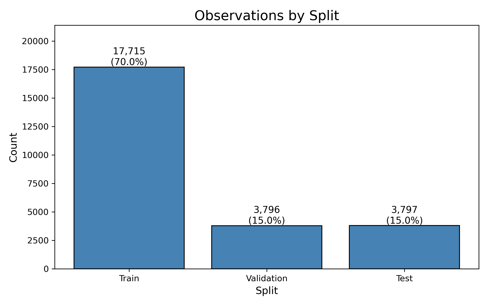

### Target Drift

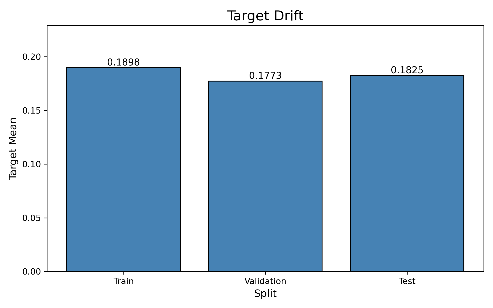

The target mean is relatively stable across splits (17.7% to 19.0%), indicating minimal target drift over time. This is favorable for model stability.

---

## 3. Preprocessing

The preprocessing pipeline uses sklearn's `Pipeline` and `ColumnTransformer` to ensure reproducibility and prevent data leakage. The pipeline is fit on the training data only.

### Pipeline Design

The pipeline is structured in two stages:

1. **Feature Engineering** (`FeatureEngineer`): a custom sklearn transformer that creates new features without dropping any columns:
   - `int_age`: derived from date of birth. Age is a known predictor of creditworthiness.
   - `flt_payment_to_income`: loan amount divided by stated income. This is a standard credit risk feature that measures borrower capacity.

2. **Column Transformer**: applies different preprocessing to numeric vs. categorical features:
   - **Numeric (median imputation):** median is preferred over mean because credit risk data often has skewed distributions (e.g., income, loan amounts), and the median is robust to outliers. No scaling is applied because XGBoost is a tree-based algorithm that is invariant to monotonic transformations.
   - **Categorical (constant imputation + ordinal encoding):** missing values are filled with "missing" as its own category, since missingness can be informative in credit risk (e.g., missing employment length may indicate informal employment). Ordinal encoding is preferred over one-hot encoding for XGBoost because it avoids creating high-dimensional sparse features and XGBoost can learn effective splits on ordinal values. Unknown categories at inference time are encoded as -1.

### Missing Values Before and After

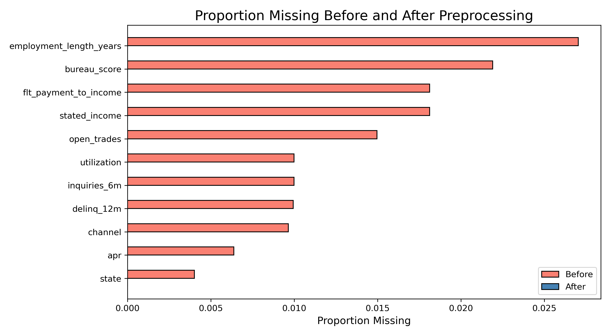

All missing values are resolved after preprocessing. The pipeline is saved to `output/preprocessing_pipeline.joblib` for reuse in the API.

---

## 4. Model

### Feature Selection

The following columns are excluded from the model features:

| Column | Reason |
|--------|--------|
| `loan_id` | Identifier with no predictive value |
| `origination_date` | Used for out-of-time splitting, not a feature |
| `dob` | Raw date, replaced by `int_age` |
| `charged_off_amount` | Post-outcome variable (data leakage) |
| `paid_interest_amount` | Post-outcome variable (data leakage) |
| `apr` | Not known at time of application |
| `flt_payment_to_income` | Derived from apr, not known at application |
| `int_age` | Excluded for fair lending / ECOA compliance |
| `state` | Excluded from model |

### Monotone Constraints

Monotone constraints are applied to ensure the model's predictions move in the expected direction for each feature. This is important for credit risk models because regulators and model validators expect directional consistency.

| Feature | Constraint | Rationale |
|---------|-----------|-----------|
| bureau_score | -1 | Higher score = lower risk |
| delinq_12m | +1 | More delinquencies = higher risk |
| utilization | +1 | Higher utilization = higher risk |
| inquiries_6m | +1 | More inquiries = higher risk |
| public_records | +1 | More records = higher risk |
| employment_length_years | -1 | Longer employment = lower risk |
| stated_income | -1 | Higher income = lower risk |
| loan_amount | +1 | Larger loans = higher risk |
| term_months | +1 | Longer terms = higher risk |
| has_prior_loans_with_us | 0 | Could go either way |
| channel | 0 | Categorical, no natural ordering |

### Bayesian Hyperparameter Tuning

Bayesian optimization via Optuna (50 trials) is used instead of grid or random search because it models the objective function and intelligently explores the hyperparameter space, converging on good configurations faster. Early stopping on the validation set prevents overfitting and automatically determines the optimal number of boosting rounds.

No sample weights or `scale_pos_weight` are used. The model is trained on the natural class distribution (~19% default rate), which produces well-calibrated probability estimates without requiring post-hoc calibration.

### Best Hyperparameters

| Parameter | Value |
|-----------|-------|
| max_depth | 3 |
| learning_rate | 0.123 |
| min_child_weight | 4 |
| subsample | 0.732 |
| colsample_bytree | 0.987 |
| gamma | 4.859 |
| reg_alpha | 1.14e-08 |
| reg_lambda | 1.88e-07 |

### Optimization History

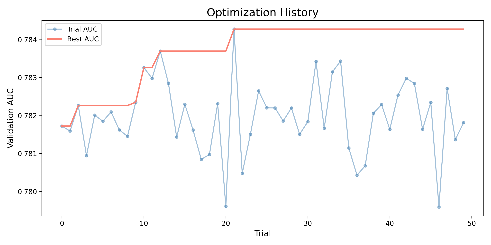

### Feature Importance (Gain vs SHAP)

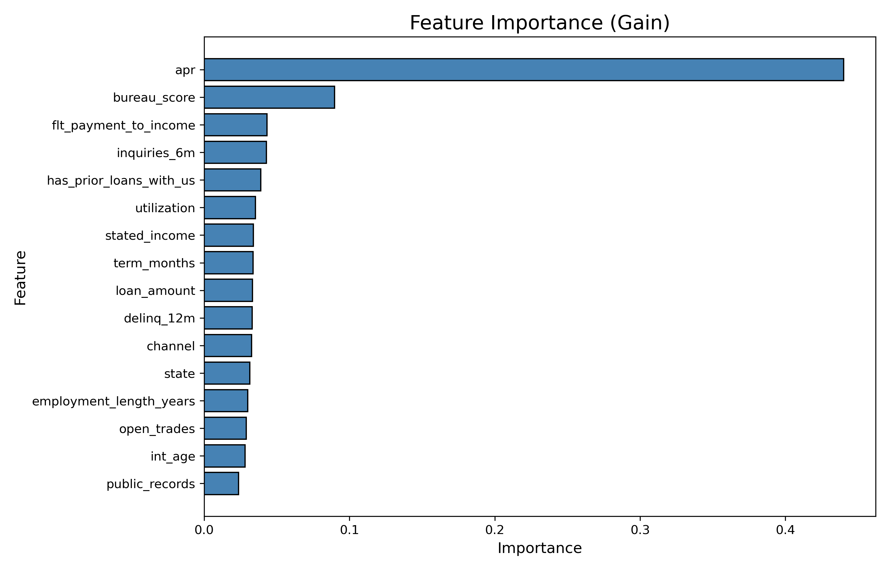

Bureau score, utilization, and employment length are the most important features by both gain and SHAP measures, which aligns with credit risk domain knowledge.

---

## 5. Model Evaluation

### Metrics Summary

| Split | AUC | Gini | KS | PR AUC | Brier | Median Pred |
|-------|-----|------|-----|--------|-------|-------------|
| Train | 0.8158 | 0.6317 | 0.4738 | 0.5342 | 0.1191 | 0.1286 |
| Validation | 0.7843 | 0.5686 | 0.4297 | 0.4805 | 0.1196 | 0.1302 |
| Test | 0.8016 | 0.6032 | 0.4648 | 0.4815 | 0.1200 | 0.1293 |

Key observations:
- **AUC** is stable across splits (0.78-0.82), indicating the model generalizes well to out-of-time data.
- **Gini** of 0.60 on the test set is a strong result for a credit risk model.
- **KS** of 0.46 on test shows good separation between defaulters and non-defaulters.
- **Brier score** is consistent across splits (~0.12), indicating stable calibration.
- **Median prediction** is consistent (~0.13), close to the population default rate.

### ROC Curves

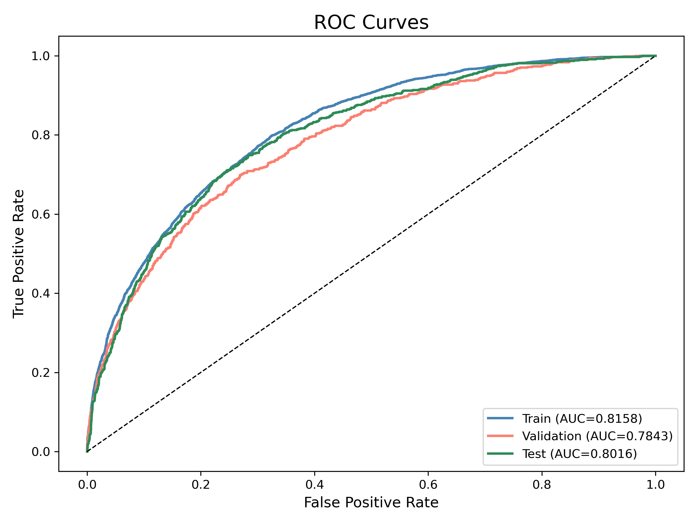

All three splits show strong discrimination with AUC values above 0.78. The test curve closely tracks the training curve, confirming no significant overfitting.

### Precision-Recall Curves

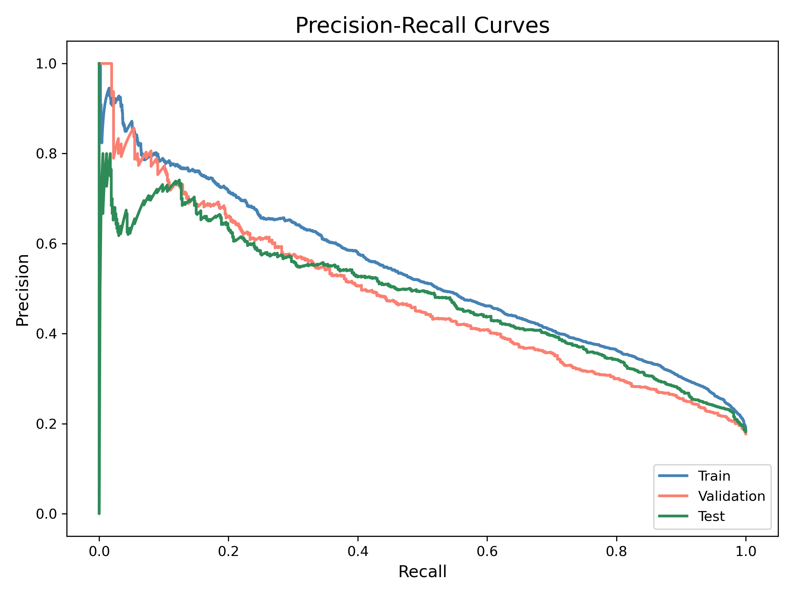

### Calibration

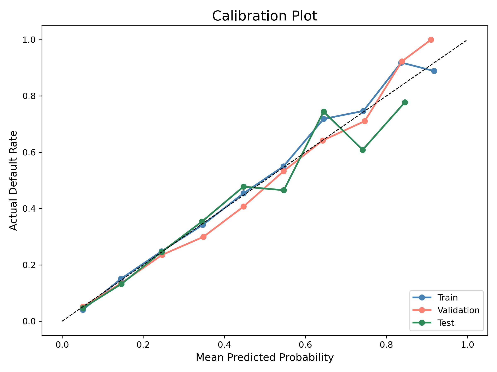

Calibration measures how well the predicted probabilities match actual default rates. Points close to the diagonal indicate good calibration. This is critical for credit risk because predicted probabilities are used directly for pricing and capital allocation. The model shows good calibration across all splits without requiring post-hoc calibration.

### KDE of Predictions

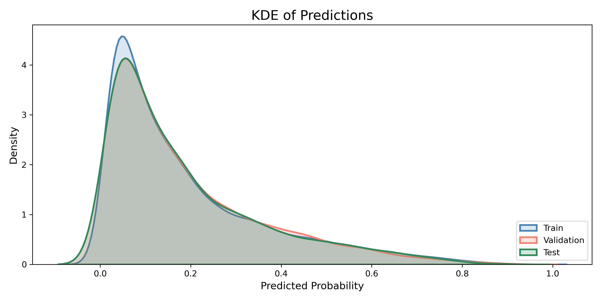

The prediction distributions are nearly identical across train, validation, and test sets, indicating stable model behavior and no evidence of overfitting or data drift.

### Confusion Matrix (Test Set)

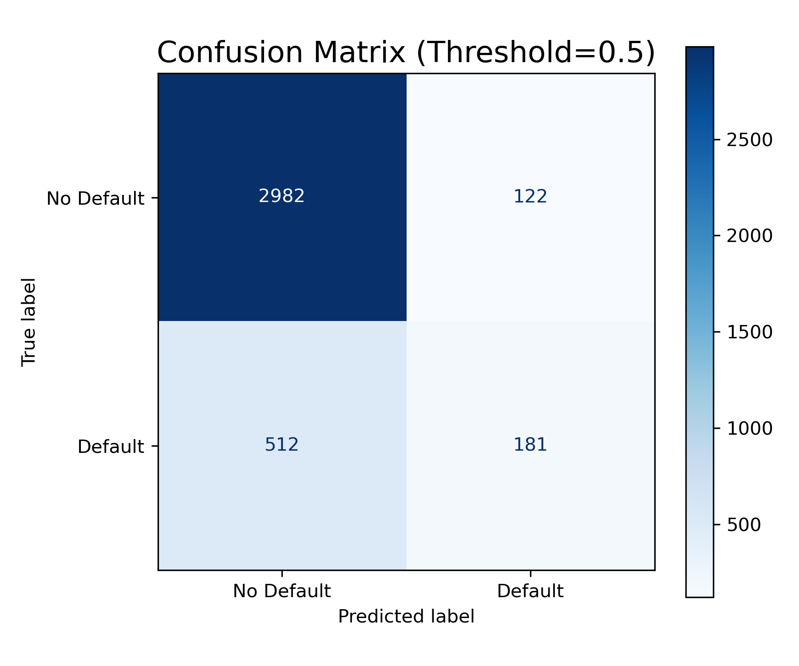

### SHAP Partial Dependence Plots

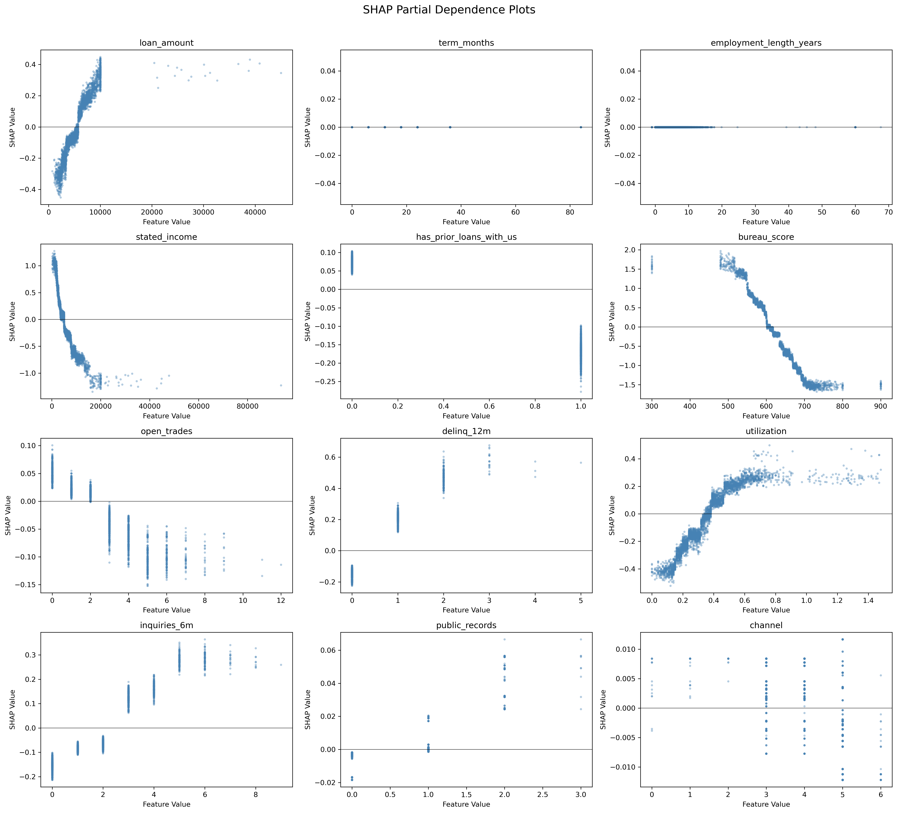

SHAP partial dependence plots confirm that monotone constraints are being respected. For example, bureau_score shows a strictly decreasing relationship with SHAP values (higher scores push predictions lower), and utilization shows a strictly increasing relationship.

---

## 6. Disparate Impact

Under ECOA (Equal Credit Opportunity Act), age is a protected class. Although `int_age` was excluded from model features for compliance, we must verify the model does not produce disparate outcomes across age groups. Applicants are segmented into under 60 and 60+ for this analysis, evaluated on the test set only.

### Metrics by Age Group

| Group | N | Target Mean | Pred Mean | Pred Median | AUC |
|-------|---|-------------|-----------|-------------|-----|
| <60 | 3,690 | 18.32% | 18.81% | 0.1292 | 0.8031 |
| >=60 | 107 | 15.89% | 18.45% | 0.1293 | 0.7340 |

The median predicted probability is nearly identical between groups (0.1292 vs 0.1293), suggesting no systematic bias in predictions. The AUC difference is partly attributable to the small sample size of the 60+ group (n=107).

### Mean Predicted Probability by Age Group

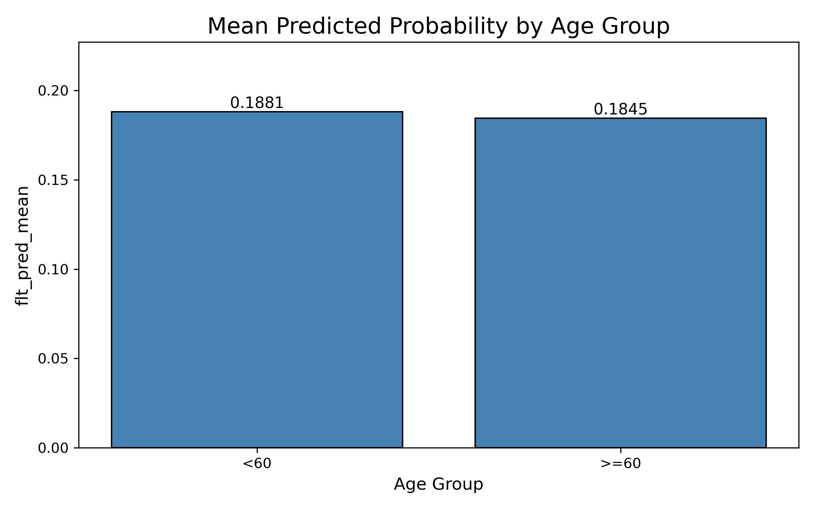

### Actual Default Rate by Age Group

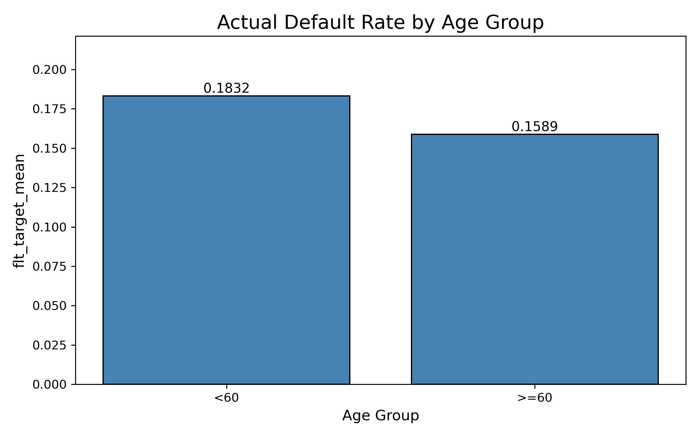

### AUC by Age Group

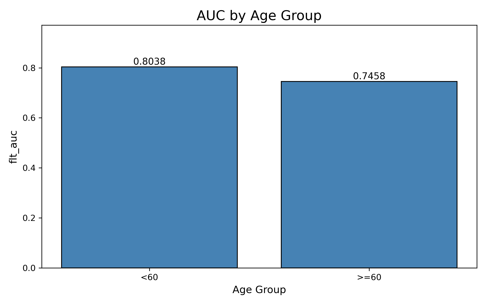

### KDE of Predictions by Age Group

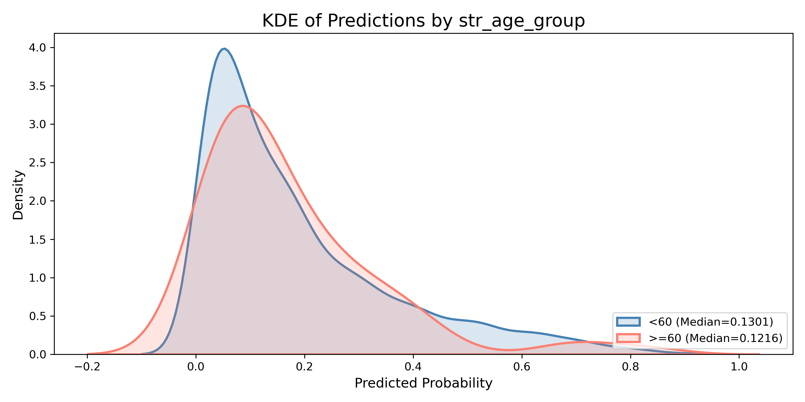

The prediction distributions between age groups are very similar, indicating the model treats both groups comparably.

### Age Proxy Model

A quick XGBoost model was trained to predict age group membership using the same features as the credit risk model. This identifies features that may act as proxies for the protected class.

### Feature Importance: Age Prediction vs Default Prediction

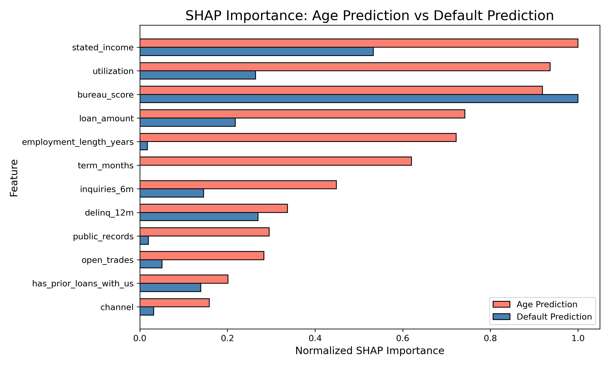

This chart compares which features are important for predicting age (salmon) vs. predicting default (steelblue). Features that are important for both are potential proxy concerns that warrant review.

### Age Proxy SHAP Partial Dependence Plots

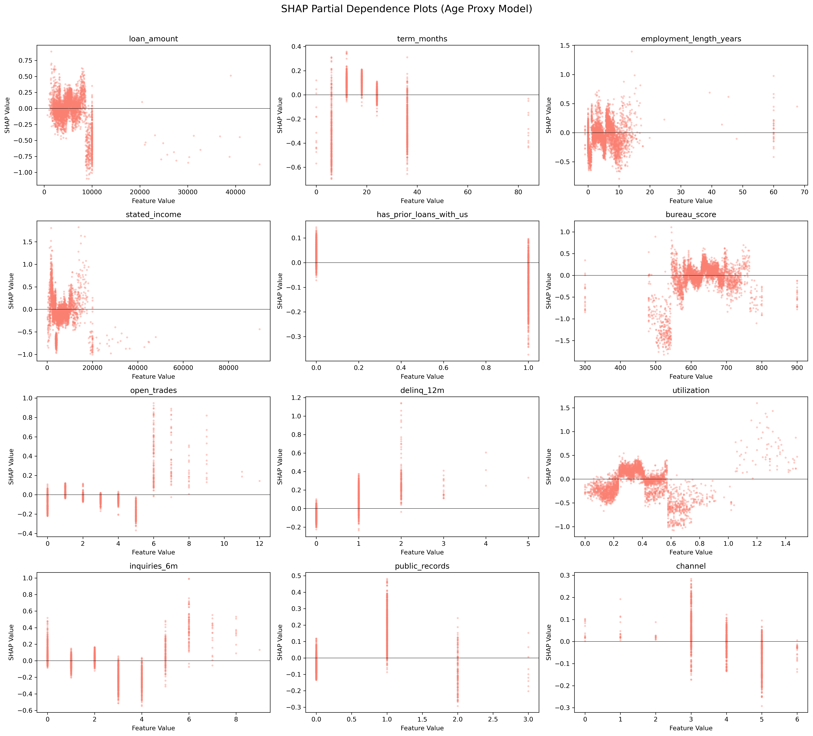

These plots show each feature's relationship with age group prediction, revealing the direction and shape of proxy relationships.

---

## 7. API

The trained model is served via a FastAPI application packaged in a Docker container.

### Endpoints

| Method | Path | Description |
|--------|------|-------------|
| GET | `/health` | Health check |
| POST | `/predict` | Returns probability of default for a loan application |

### Request Schema

```json
{
  "loan_id": 12345,
  "origination_date": "2024-06-15",
  "dob": "1985-03-20",
  "loan_amount": 5000.0,
  "term_months": 24,
  "channel": "mobile",
  "employment_length_years": 5.5,
  "stated_income": 6000.0,
  "state": "CA",
  "has_prior_loans_with_us": 0,
  "bureau_score": 650.0,
  "open_trades": 3.0,
  "delinq_12m": 0.0,
  "utilization": 0.35,
  "inquiries_6m": 2.0,
  "public_records": 0
}
```

### Response Schema

```json
{
  "flt_probability_of_default": 0.1842
}
```

### Docker

```bash
# build
docker build -t credit-risk-claude .

# run
docker run -p 8080:8080 credit-risk-claude

# test health
curl http://localhost:8080/health

# test prediction
curl -X POST http://localhost:8080/predict \
  -H "Content-Type: application/json" \
  -d '{"loan_amount": 5000, "term_months": 24, "channel": "mobile", "has_prior_loans_with_us": 0, "public_records": 0}'
```

### Logging

The API includes structured logging with the format `timestamp | level | message`. Each prediction request logs the loan_id, predicted probability of default, and elapsed time for monitoring and auditability.

---

## 8. Monitoring

Post-deployment monitoring tracks model performance and population stability over time. The training data serves as the baseline (development) population, and all time-series plots include vertical lines marking where training ends (black) and where validation ends (gray), providing full visibility into performance across the data history.

### Monitoring Summary

| Metric | Value |
|--------|-------|
| Overall PSI | 0.0011 (no significant shift) |
| Baseline Median PD | 0.1286 |
| Production Median PD | 0.1293 |
| Baseline Target Mean | 18.98% |
| Production Target Mean | 18.25% |
| Features with Moderate CSI | 0 |
| Features with Significant CSI | 0 |

### PSI Over Time

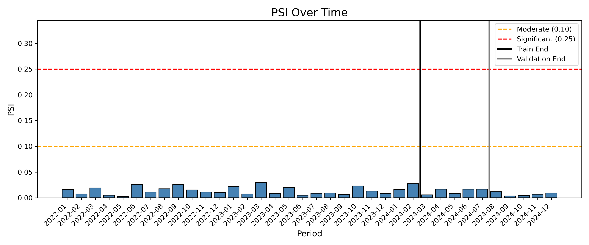

PSI measures how much the distribution of predicted probabilities has shifted from the development population. Training months (left of black line) serve as a control and should show near-zero PSI. An overall PSI of 0.0011 indicates no meaningful population shift.

### CSI by Feature

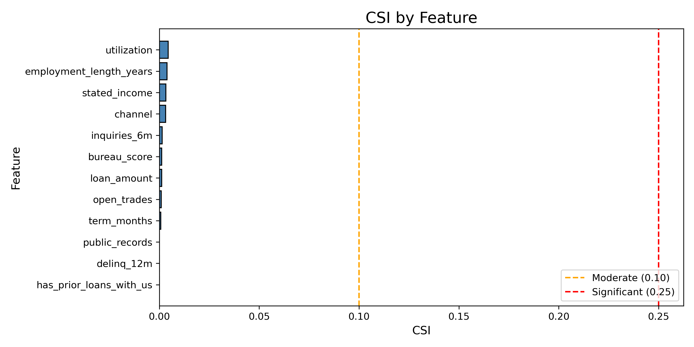

CSI applies the same stability calculation to each individual feature. All features show CSI well below 0.10, indicating no feature-level distributional drift. Features are color-coded: steelblue (stable), orange (moderate), red (significant).

| Feature | CSI |
|---------|-----|
| utilization | 0.0044 |
| employment_length_years | 0.0039 |
| stated_income | 0.0032 |
| channel | 0.0031 |
| inquiries_6m | 0.0014 |
| bureau_score | 0.0012 |
| loan_amount | 0.0012 |
| open_trades | 0.0010 |
| term_months | 0.0007 |
| public_records | 0.0000 |
| delinq_12m | 0.0000 |
| has_prior_loans_with_us | 0.0000 |

### Target Drift Over Time

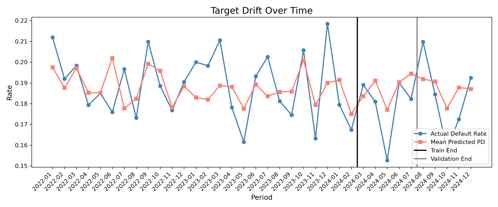

Comparing actual default rates against mean predicted PD over time. The two lines tracking closely indicates the model's calibration is holding. Divergence would signal calibration degradation.

### AUC Over Time

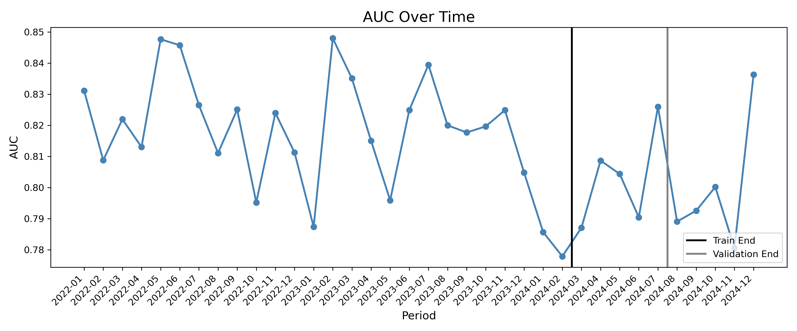

Model discrimination tracked monthly. A declining AUC in post-deployment periods would indicate the model's ability to rank-order risk is degrading.

### Calibration Over Time

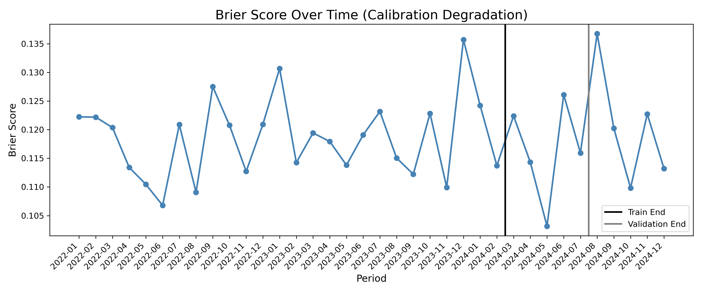

Brier score tracked monthly. An increasing Brier score in post-deployment periods would indicate calibration degradation.

### KDE of Predictions Over Time

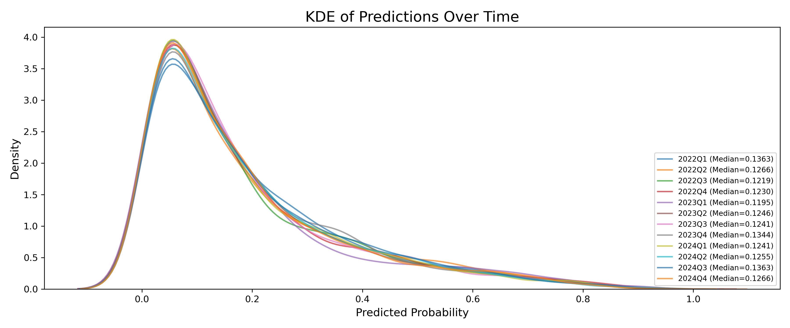

Quarterly prediction distributions with median in legend. Stable, overlapping distributions confirm the model is behaving consistently over time.

---

## 9. Champion-Challenger

The champion-challenger framework compares the current production model against a candidate replacement. Both models are evaluated on the same out-of-time test set to ensure a fair comparison.

- **Champion:** tuned XGBoost with monotone constraints (current production model)
- **Challenger:** untuned SVM with RBF kernel + StandardScaler (baseline comparison)

### Metrics Comparison

| Model | AUC | Gini | KS | Brier | Median Pred |
|-------|-----|------|-----|-------|-------------|
| Champion (XGBoost) | 0.8016 | 0.6032 | 0.4648 | 0.1200 | 0.1293 |
| Challenger (SVM) | 0.7480 | 0.4961 | 0.4462 | 0.1270 | 0.1380 |

The champion outperforms the challenger across all metrics: better discrimination (AUC, Gini, KS) and better calibration (Brier).

### AUC Comparison

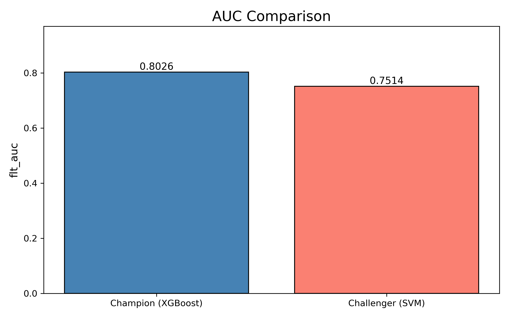

### Gini Comparison

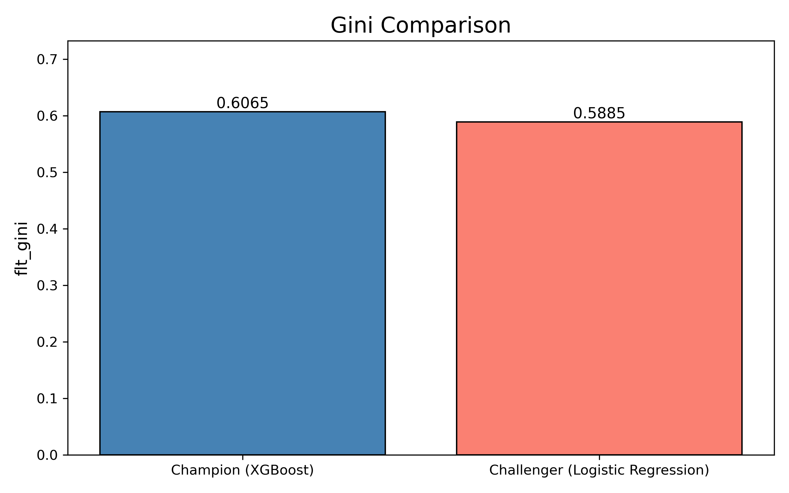

### KS Comparison

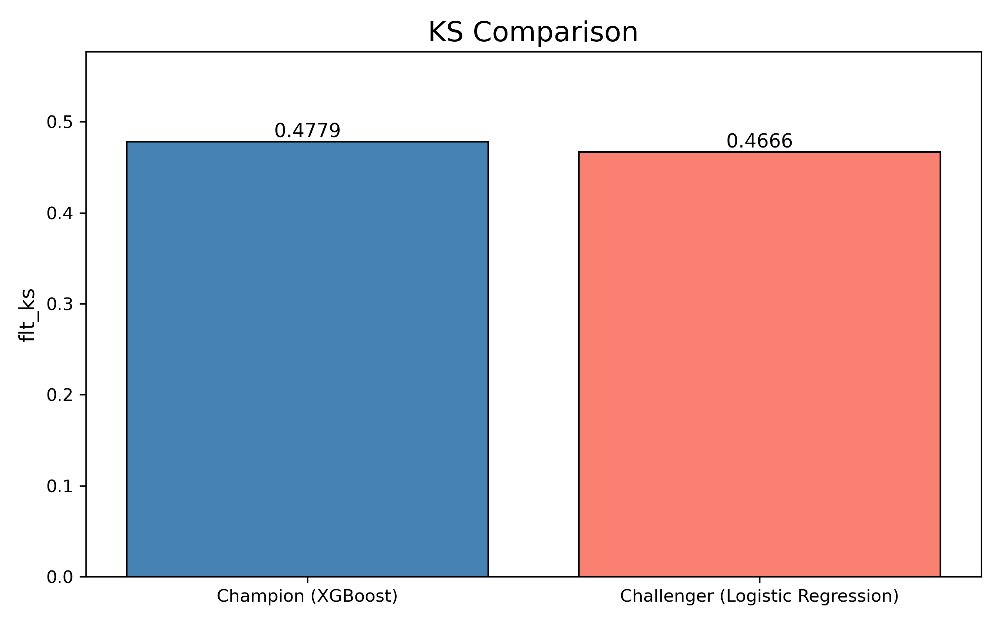

### ROC Comparison

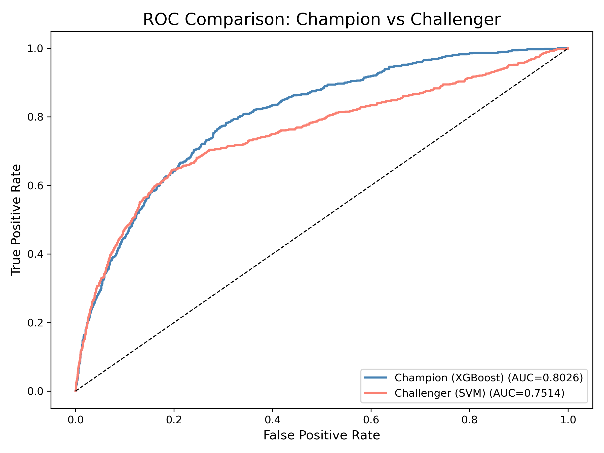

### Calibration Comparison

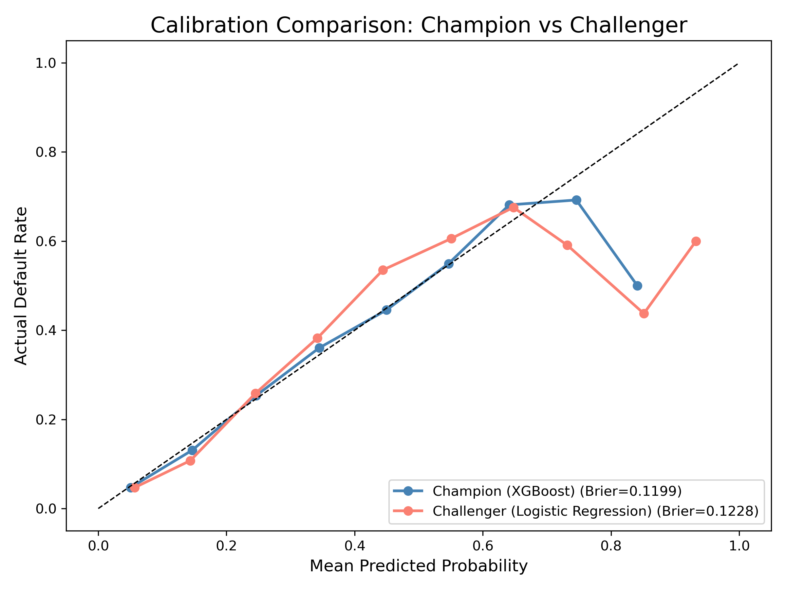

### KDE Comparison

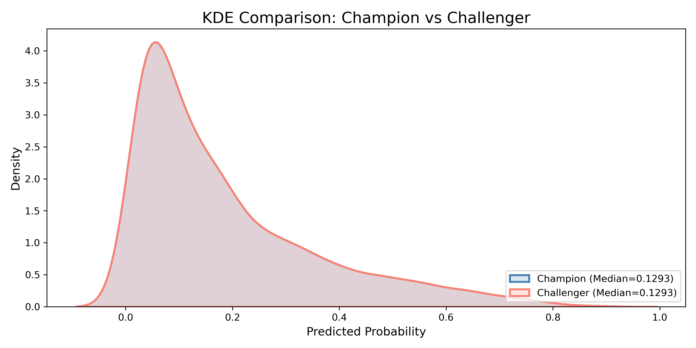

### Recommendation

The challenger (SVM) does not improve over the champion (XGBoost) on either discrimination or calibration. **Recommendation: retain current production model.**

---

## Tech Stack

- **Language:** Python 3.11+
- **Model:** XGBoost with Bayesian tuning (Optuna)
- **Explainability:** SHAP
- **Data Storage:** AWS S3
- **Serving:** FastAPI
- **Containerization:** Docker
- **Automation:** Claude Code Skills

## Folder Structure

```
credit_risk_claude/
├── 01_eda/                  # Exploratory data analysis
│   ├── notebook.ipynb
│   └── output/              # Plots and descriptive statistics
├── 02_data_split/           # Out-of-time train/validation/test splitting
│   ├── notebook.ipynb
│   └── output/              # Split summary and plots
├── 03_preprocessing/        # Feature engineering and preprocessing
│   ├── notebook.ipynb
│   └── output/              # Pipeline artifact and plots
├── 04_model/                # XGBoost training with Optuna
│   ├── notebook.ipynb
│   └── output/              # Model, params, and plots
├── 05_model_eval/           # Model evaluation and performance
│   ├── notebook.ipynb
│   └── output/              # Metrics and plots
├── 06_disparate_impact/     # Fair lending analysis
│   ├── notebook.ipynb
│   └── output/              # Disparate impact metrics and plots
├── 07_monitoring/           # Post-deployment model monitoring
│   ├── notebook.ipynb
│   └── output/              # PSI, CSI, drift plots
├── 08_champion_challenger/  # Champion vs challenger comparison
│   ├── notebook.ipynb
│   └── output/              # Comparison metrics and plots
├── api/                     # Model serving
│   └── notebook.ipynb       # Creates all API artifacts via %%writefile
├── .claude/
│   └── skills/              # Claude Code skills for each step
└── README.md
```
